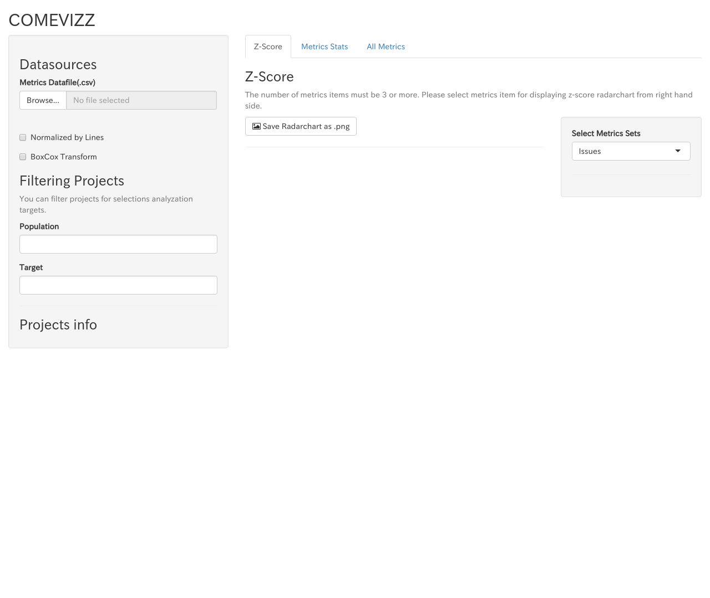

# Install comevizz

## Environments

* Ubuntu 16.04 xenial
* R v3.3.2

<!--## Ubuntu 16.04-->


### Install `R`
* Reference: [UBUNTU PACKAGES FOR R](https://cran.r-project.org/bin/linux/ubuntu/README.html)

First, you need to install R by the following commands.
```
$ sudo echo "deb http://cran.rstudio.com/bin/linux/ubuntu xenial/" | sudo tee -a /etc/apt/sources.list
$ gpg --keyserver keyserver.ubuntu.com --recv-key E084DAB9
$ gpg -a --export E084DAB9 | sudo apt-key add -

$ sudo apt-get update
$ sudo apt-get install r-base
```

Make sure the installation of `R` by executing `R --version` command.

```
$ R --version
R version 3.3.2 (2016-10-31) -- "Sincere Pumpkin Patch"
Copyright (C) 2016 The R Foundation for Statistical Computing
Platform: x86_64-pc-linux-gnu (64-bit)

R is free software and comes with ABSOLUTELY NO WARRANTY.
You are welcome to redistribute it under the terms of the
GNU General Public License versions 2 or 3.
For more information about these matters see
http://www.gnu.org/licenses/.
```

### Install `comevizz`

After obtaining `comevizz` source code, execute the following commands.

```
# Install apt packages
$ sudo apt install -y libcurl4-openssl-dev libssl-dev libssh2-1-dev
# Install devtools
$ sudo R -e "install.packages('devtools', repos='https://cran.ism.ac.jp/')"

# Install apt packages for depending R libraries
$ sudo apt install -y libxml2-dev
# Install dependencies
$ sudo R -e "library(devtools); devtools::install_dev_deps()"
```

### Run `comevizz`

```
$ sudo R -e "devtools::load_all('.'); comevizz::run()"
Loading comevizz

Listening on http://0.0.0.0:3838
```

By opening `http://localhost:3838` on your browser, you can see the following screen.


