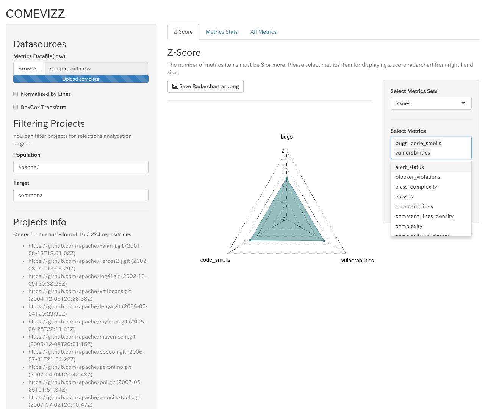
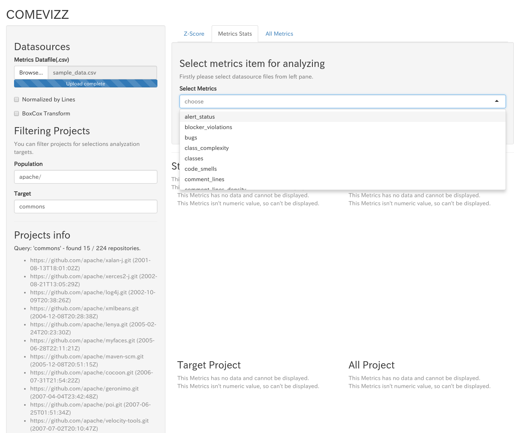

# Usage of comevizz

### Reading csv file of metrics data

Select metrics csv file from **Browse...** button.  
Refer [Appendix B. The Format of Metrics Data File](./A-appendix.md#appendix_metrics_format) about the requirements of the csv file for metrics data.

When loading the metrics data file is completed, you can see the following screen.


* * *

## Display Z-Score

You can see Z-Score Radar chart from **Metrics Z-Score** tab.  
See [Appendix C. How to calculate Z-Score](./A-appendix.md#z-score) about Z-Score.

COMEVIZZ displays Z-Score Radar chart for target projects filtered by [Filtering population and target](#filtering).

For example, when you select `Apache` projects as population and `commons-*` projects as target projects, you can see the following screen.


If you do not select any target projects, All Z-Score will be `0`.

---

### Select metrics types for Z-Score Radar chart

#### Select the set of metrics types

You can select the sets of metrics types from **Select Metrics Sets** on the right pane.

| Metrics Set Name | Metrics types|
|:-----------------|:---------|
| Issues           | bugs, code_smells, vulnerabilities |
| Violations       | blocker_violations, critical_violations, info_violations, major_violations, minor_violations, violations |
| Complexity       | class_complexity, complexity, function_complexity |


#### Select metrics by yourself

You can select specific metrics from **Select Metrics** on the right pane.
Selectable metrics are generated from the headers of metrics data csv file.




### Download Z-Score radarchart as image

If clicking the button `Save Radarchart as .png` at the top of radarchart, You can open the dialog for saving Z-Score radarchart as image.


Clicking `Download` button, the displayed radarchart is downloaded as PNG image.  
You can change download file name at `Download FileName`.  
If you check `Embed descriptions of filtering option in image`, descriptions of you specified filtering option is added on image.  


* * *

## Display the statistical information

By selecting metrics type, you can see the statistical information of the selected metrics.




1. Average / Median / Standard Deviation
  * See [Filtering the Population and Target](#filtering) about filtering population and target projects
2. Cumultive distribution function
3. Probabilistic density funciton
4. Data table about metrics values

---

## Filtering population and target {#filtering}

You can filter projects for displaying from **Filtering Projects** on the left pane.


The results of filtering will be displayed on **Projects Info**.

### Population

You can filter projects as a population by using regular expresison for `url` string.  

Example 1: In case of filtering `Apache` projects published in `github.com` as a population,

```
gihtub.com/apache/
```

Example 2: In case of filtering `Apache` and `spring-projects` projects published in `github.com` as a population,

```
gihtub.com/apache/|github.com/spring-projects
```

### Target

Filtering projects as a target for statistical analysis and Z-Score by using regular expression for `url` string.  
Target projects must be included in the populations.

## 

### Normalize by lines

By checking **Normalize by lines**, you can normalize the selected metrics values by dividing by `Lines` metrics value.


### Transform metrics distributions to normal distribution

By checking **BoxCox Transform**, you can transform metrics distributions to normal distribution by BoxCox Transformation.


