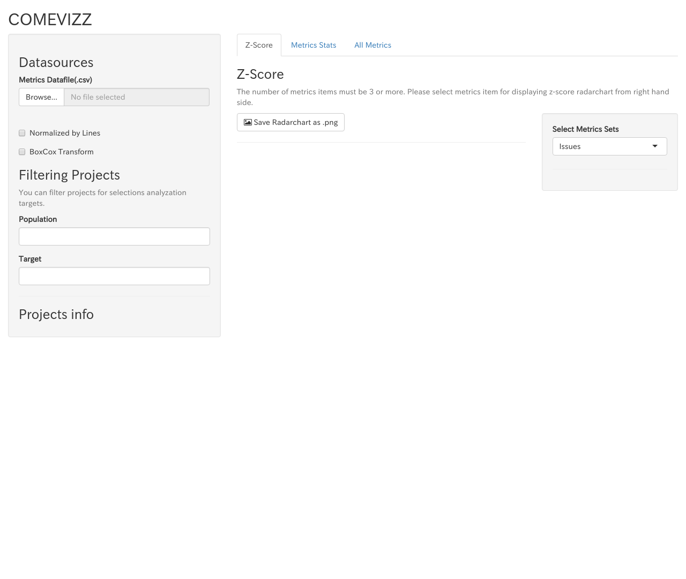

# インストール方法

## 動作確認環境

* Ubuntu 16.04 xenial
* R v3.3.2

## 環境:Ubuntu 16.04

### Rインストール
* 参考: [UBUNTU PACKAGES FOR R](https://cran.r-project.org/bin/linux/ubuntu/README.html)

Rのインストールを行います。
```
$ sudo echo "deb http://cran.rstudio.com/bin/linux/ubuntu xenial/" | sudo tee -a /etc/apt/sources.list
$ gpg --keyserver keyserver.ubuntu.com --recv-key E084DAB9
$ gpg -a --export E084DAB9 | sudo apt-key add -

$ sudo apt-get update
$ sudo apt-get install r-base
```

`R`コマンドが正常に動作すればインストール完了です。
```
$ R --version
R version 3.3.2 (2016-10-31) -- "Sincere Pumpkin Patch"
Copyright (C) 2016 The R Foundation for Statistical Computing
Platform: x86_64-pc-linux-gnu (64-bit)

R is free software and comes with ABSOLUTELY NO WARRANTY.
You are welcome to redistribute it under the terms of the
GNU General Public License versions 2 or 3.
For more information about these matters see
http://www.gnu.org/licenses/.
```

### ソースコード＆依存ライブラリのインストール

comevizzのソースコードを入手し、下記のコマンドを実行します.

```
# devtoolsのインストールに必要なライブラリをインストール
$ sudo apt install -y libcurl4-openssl-dev libssl-dev libssh2-1-dev
# devtoolsのインストール
$ sudo R -e "install.packages('devtools', repos='https://cran.ism.ac.jp/')"

# 依存ライブラリのインストールに必要なライブラリをインストール
$ sudo apt install -y libxml2-dev
# 依存ライブラリのインストール
$ sudo R -e "library(devtools); devtools::install_dev_deps()"
```

### 起動方法

`R`コマンドによりcomevizzを起動します
```
$ sudo R -e "devtools::load_all('.'); comevizz::run()"
Loading comevizz

Listening on http://0.0.0.0:3838
```

ブラウザで`http://localhost:3838`にアクセスし,下記画面が表示されれば起動完了です.


