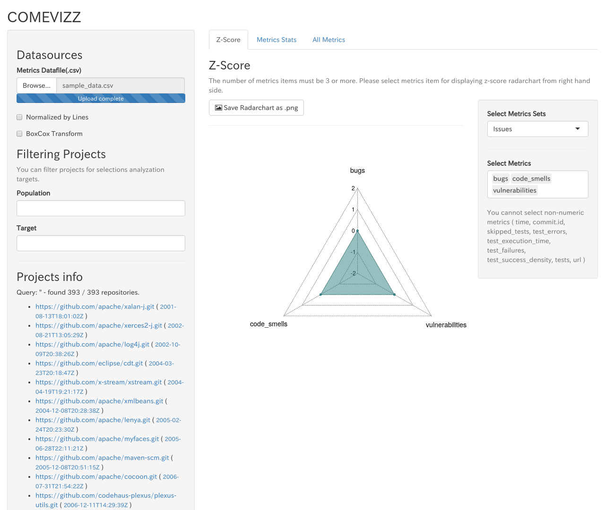

# comevizz操作方法

### メトリクスデータ読み込み

画面左上の **Browse...** ボタンからメトリクス情報ファイルを指定します.  
読み込ませるメトリクス情報ファイルの形式については [付録B. メトリクス情報ファイルフォーマット](A-appendix.md#appendix_metrics_format) を参照してください.

メトリクス情報ファイルの読み込みが完了すると,下記画面が表示されます.



* * *

## Z-Score表示

**Metrics Z-Score**タブからプロジェクトのソースコード偏差値を表示することができます.  
Z-Scoreの表す値については[付録C. Z-Score](A-appendix.md#z-score)を参照してください.

[母集団・ターゲーットプロジェクトのフィルタリング](#filtering)の**Target**で指定されたプロジェクトのZ-Scoreがレーダーチャートに表示されます.
例として,Apacheプロジェクトを母集団として`commons`系のプロジェクトのZ-Scoreを表示した場合,下記のような表示となります.


**Target**に何も指定しない場合,各メトリクスのZ-scoreは基準値である`0`となります.

---

### Z-Score表示するメトリクスの選択

Z-Score表示するメトリクスを選択することができます.


#### メトリクスセットを選択する

画面右の **Select Metrics Sets** から複数のメトリクスを一度に選択することができます.  
現在選択できるメトリクスセットは下記の通りです.

| メトリクスセット名 | メトリクス種別 |
|:----------------|:---------|
| Issues          | bugs, code_smells, vulnerabilities |
| Violations      | blocker_violations, critical_violations, info_violations, major_violations, minor_violations, violations |
| Complexity      | class_complexity, complexity, function_complexity |


#### メトリクスを自分で選ぶ

画面右の **Select Metrics** から自由にメトリクスを選択することもできます.  
選択候補として表示されるメトリクス名は,読み込ませたメトリクスCSVファイルのヘッダー行を元に生成されています.


* * *

## 統計情報表示

メトリクスデータを読み込んだ後,画面中央の **Select Metrics** からメトリクス名を選択すると統計情報が表示されます.


---

読み込みが完了すると統計情報が表示されます.


1. 平均(Average) / 中央値(Median) / 標準分散(Standard Deviation）
  * 母集団(Population) / ターゲット(Target) の指定方法については [母集団・ターゲットプロジェクトのフィルタリング](#filtering) を参照してください.
2. 累積密度分布関数
3. 確率密度関数
4. メトリクスデータテーブル


## 母集団・ターゲットプロジェクトのフィルタリング {#filtering}

画面左の **Filtering Projects** にプロジェクト名の一部を入力することで,表示対象プロジェクトのフィルタリングを行うことができます.


フィルタリングされた結果は画面左下の**Projects Info**に表示されます.

### Population

統計情報・Z-score表示の母集団を`url`文字列をベースにフィルタリングします.
フィルタリングしたいプロジェクトの`url`を正規表現で入力します.

例1: github.comで公開されているapacheプロジェクを母集団として選択する場合

```
gihtub.com/apache/
```

例2: github.comで公開されているapacheとspring-projectsのプロジェクトを母集団として選択する場合
```
gihtub.com/apache/|github.com/spring-projects
```


### Target

統計情報・Z-score表示のターゲットプロジェクトを指定できます.

母集団(Population)と同様,入力文字列に正規表現として該当するプロジェクトのみがターゲットプロジェクトとして選択されます.
母集団プロジェクトの中から**Target**に入力した文字列でさらにフィルタリングされた結果が選択されます.

## メトリクス値の変換

### 総行数(lines)による正規化

チェックボックス　**Normalized by lines**を選択すると,メトリクス値を各プロジェクトの総行数で正規化したメトリクス値の統計情報を表示することができます.


### 正規分布への近似

チェックボックス　**BoxCox Transform**を選択すると,メトリクス値の分布を正規分布へ近づけるBoxCox変換を実行することができます.


